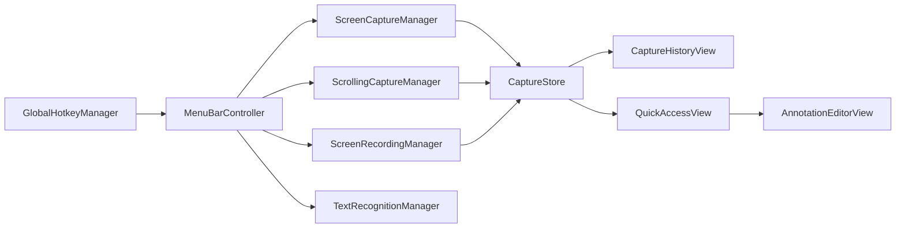

<p align="center">
  
</p>

<h1 align="center">Kagami</h1>

<p align="center"><em>Capture everything. Keep it local.</em></p>

<p align="center">
  A free, lightweight menu bar app for screenshots, screen recordings, and GIFs on macOS.
</p>

<p align="center">
  <a href="https://github.com/benkrogh/Kagami/releases/latest">Download for Mac</a>
  ·
  <a href="#building-from-source">Build from source</a>
  ·
  <a href="Landing/index.html">Landing page</a>
</p>

<p align="center">
  
  
  
  
</p>

---

## Download

**[Download the latest release for Mac](https://github.com/benkrogh/Kagami/releases/latest)**

Releases ship as `Kagami-1.0.1.pkg` in the `dist/` folder. Open the installer and Kagami will be placed in your Applications folder.

On first launch, grant **Screen Recording** permission in **System Settings → Privacy & Security → Screen Recording**.

---

## Features

### Screenshots

Capture your screen exactly how you need it:

- **Area, window, or fullscreen** capture modes
- Export as **PNG, JPG, or TIFF**
- Optional **self-timer** (0, 1, 3, or 5 seconds)
- **Quick Access** panel after capture — copy, save, annotate, or share

### Scrolling Capture

> Grab those pesky tall screenshots in one go.

Start a scrolling capture and Kagami rides the page down for you — auto-scrolling, stitching every frame together, and handing you back one clean image. Manual scroll stitching with live preview is also supported.

### Screen Recording

> Record more than just your screen.

Kagami captures your screen alongside system audio, your microphone, and a live webcam bubble, all saved locally as video or GIF when you stop.

- **MP4 video** or **GIF** (up to 20 seconds)
- Record a selected **area** or the **full screen**
- Optional **microphone** and **system audio**
- **Webcam bubble** overlay (circle or rounded square)
- **Keystroke** and **click highlight** overlays
- Configurable **quality**, **frame rate**, and **countdown**

### Annotations

> Bust out the toolbox for extra ideas.

Bring any capture into Kagami's annotation editor to mark up what matters before you send it anywhere. Twelve tools including arrows, lines, shapes, text, highlight, pencil, spotlight, and crop — with full undo/redo.

### OCR

Select an area on screen and Kagami uses Apple's Vision framework to recognize text and copy it to your clipboard.

### Capture History

Browse, filter, and search all your captures. Annotate or reveal in Finder from the history window. Captures older than 30 days are automatically pruned.

### Utilities

- **Pin Screenshot** — float a capture as an always-on-top reference window with adjustable opacity
- **Hide Desktop Icons** — clean up your desktop before capturing

### Privacy

> Your ideas are safe here.

Kagami has **no cloud storage, no account, and no terms of service** granting anyone rights to what you capture.

- **100% local** — every capture is written straight to disk on your Mac (default: `~/Pictures/Kagami`, configurable)
- **No sign-in** — just open Kagami and start capturing
- **Works offline** — no internet connection required

---

## Keyboard Shortcuts

Kagami registers global shortcuts that work system-wide:

| Shortcut | Action |
|----------|--------|
| ⌘⇧1 | Capture Area |
| ⌘⇧2 | Capture Window |
| ⌘⇧3 | Capture Fullscreen |
| ⌘⇧4 | Start / Stop Recording |
| ⌘⇧5 | Scrolling Capture |
| ⌘⇧T | Text Recognition (OCR) |
| ⌘⇧Y | Capture History |

| Shortcut | Action |
|----------|--------|
| ⌘, | Settings |
| ⌘Q | Quit Kagami |

---

## Building from Source

### Requirements

- macOS 14+
- Apple Silicon (arm64)
- Xcode Command Line Tools / Swift 5.9+

### Build

```bash
git clone https://github.com/benkrogh/Kagami.git
cd Kagami
./build.sh              # build + install to /Applications
./build.sh --no-install # build Kagami.app only
./build.sh --package    # build + dist/Kagami-1.0.1.zip + .pkg
./build.sh --pkg        # build + dist/Kagami-1.0.1.pkg only
```

Kagami is a native Swift app built with AppKit, SwiftUI, ScreenCaptureKit, and Vision.

---

## Permissions

| Permission | Required for |
|------------|-------------|
| Screen Recording | All screenshots and recordings |
| Microphone | Optional recording audio |
| Camera | Webcam overlay |
| Accessibility | Auto-scroll in scrolling capture; keystroke overlay |

---

## Project Structure

```
Sources/Kagami/
├── Capture/      # Screenshots, scrolling capture, area selection
├── Recording/    # Screen recording, webcam, GIF export
├── Annotation/   # Markup editor
├── History/      # Capture store and browser
├── OCR/          # Text recognition
├── Hotkeys/      # Global shortcuts
└── ...
Landing/          # Static marketing site
```



---

## Author

Designed and built by [Ben Krogh](https://www.benkrogh.com)

## License

MIT — see [LICENSE](LICENSE)
